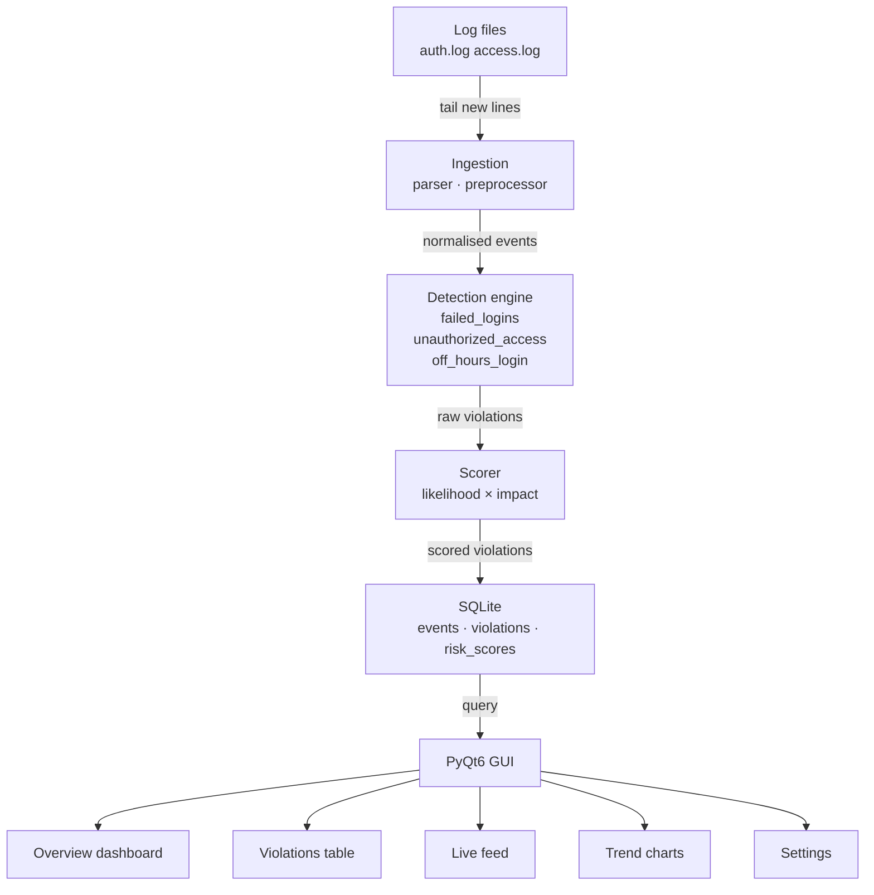
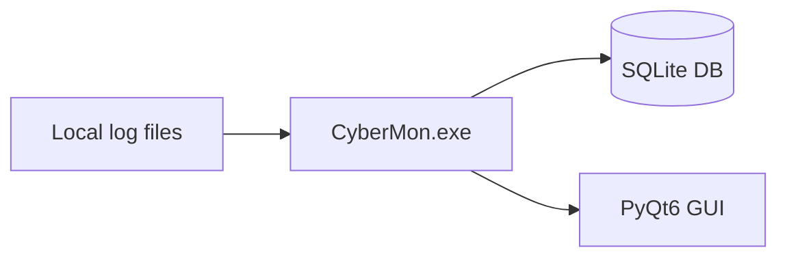
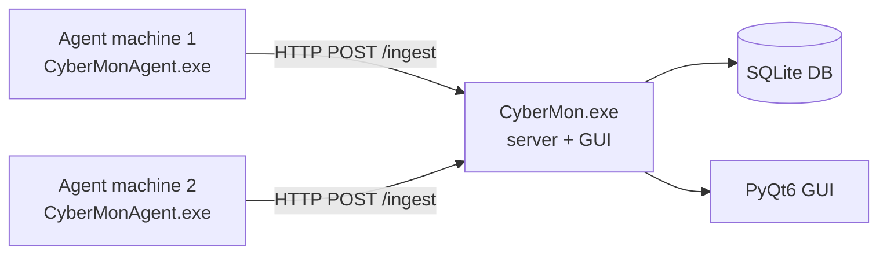

# CyberMon v2.0

> A native desktop cybersecurity monitoring application for Windows.  
> Ingests Linux auth logs and Apache access logs, detects three classes of policy violation, scores each by risk, and surfaces everything in a live PyQt6 GUI — no browser required.

---

## What it does

CyberMon watches your log files in real time. When a suspicious pattern appears — a brute-force SSH attempt, a probe of a restricted URL, or a successful login at 3 AM — it detects the violation, scores it on a 1–25 likelihood × impact scale, persists it to a local SQLite database, and displays it immediately in the desktop interface. No page refresh. No browser.

It ships as a standalone `.exe`. No Python installation required on the target machine.

---

## How it works



On startup CyberMon runs a full pipeline pass over the configured log files, then keeps a background `LogWatcher` thread tailing both files continuously. New violations written by the watcher appear in the live feed and overview within 3 seconds.

---

## Detection rules

| Rule | What triggers it | Configurable |
|------|-----------------|--------------|
| **Failed logins** | N failed SSH attempts for the same user within a rolling time window | threshold, window (minutes) |
| **Unauthorized access** | HTTP 4xx response on a restricted resource path | resource list, status codes |
| **Off-hours login** | Successful SSH login outside business hours | days, start time, end time |

All rules are implemented in `src/detection/`. Thresholds and resource lists are set in `config/config.yaml`.

---

## Risk scoring

Every violation is scored as **Likelihood × Impact** (each 1–5), producing a score from 1 to 25 mapped to four severity tiers:

| Score | Severity | Colour |
|-------|----------|--------|
| 1 – 4 | Low | Green |
| 5 – 9 | Medium | Amber |
| 10 – 16 | High | Red |
| 17 – 25 | Critical | Dark red |

The tier boundaries live in `config/config.yaml` under `scoring.severity_tiers` — nothing is hardcoded.

---

## GUI panels

CyberMon has five panels accessible from the sidebar.

### Overview

```
┌─────────────────────────────────────────────────────────┐
│  Total        Critical     High        Medium     Low   │
│  ┌──────┐    ┌──────┐    ┌──────┐    ┌──────┐  ┌─────┐ │
│  │  13  │    │   1  │    │   6  │    │   4  │  │  2  │ │
│  └──────┘    └──────┘    └──────┘    └──────┘  └─────┘ │
│                                                         │
│  By type                    ┌──── Severity split ────┐  │
│  Failed logins    ████░░░   │        ╭───╮           │  │
│  Unauth access    ██░░░░░   │     ╭──╯   ╰──╮        │  │
│  Off-hours        █░░░░░░   │    ─╯          ╰─       │  │
│                             └───────────────────────┘  │
└─────────────────────────────────────────────────────────┘
```

Five metric cards (Total / Critical / High / Medium / Low), per-type breakdown bars, and a doughnut chart showing severity distribution. Refreshes every 3 seconds.

### Violations table

```
┌──┬──────────────────────┬──────────┬────────┬────────┬──────────────────────┐
│ID│ Type                 │ Score    │ User   │ Host   │ Timestamp            │
├──┼──────────────────────┼──────────┼────────┼────────┼──────────────────────┤
│9 │ failed_logins        │ 20 ████  │ admin  │ srv-01 │ 2026-06-08 02:14     │
│7 │ unauthorized_access  │ 15 ████  │ —      │ srv-01 │ 2026-06-08 01:55     │
│3 │ off_hours_login      │  6 ██    │ fztu   │ srv-01 │ 2026-06-07 23:40     │
└──┴──────────────────────┴──────────┴────────┴────────┴──────────────────────┘
```

Sorted by risk score descending. Host filter dropdown, Export CSV button. Click any row for the full detail panel: score breakdown (L × I), raw log line, and recommended response action.

### Live feed

New violations appear as cards at the top of the feed as they are detected — no manual refresh needed. Pause / Resume / Clear controls. Each card shows severity colour, violation type, score, and source IP.

### Trend charts

Two tabs:
- **Today by hour** — line chart of all three violation types across 24 hours
- **Last 7 days** — daily totals for the past week

Built with PyQtGraph. Three colour-coded series: failed logins (purple), unauthorized access (red), off-hours logins (amber).

### Settings

Configure log paths, business hours, brute-force thresholds, and toggle Light / Dark theme. Changes are written to `config/config.yaml` immediately. Theme switches without restart.

---

## Dual mode

CyberMon supports two deployment configurations set in `config/config.yaml`:

```yaml
mode: standalone   # single machine — reads local log files directly
mode: network      # central server + remote agents
```

### Standalone mode



One machine. CyberMon reads its own log files. Suitable for a single server or a developer workstation.

### Network mode



Remote machines run `CyberMonAgent.exe` (console app, visible terminal). Each agent tails its local log file and POSTs new lines to the server on port 5001. The server runs the full detection → scoring → storage pipeline on each batch and tags each record with the originating `source_host`. All violations from all agents are visible in the single central GUI.

---

## Quick start — pre-built exe

1. Download `CyberMon_v2.0.zip` and extract it.
2. Double-click **`CyberMon.exe`** — the setup wizard opens.
3. Choose **Standalone** or **Network** mode.
4. Point the wizard at your log files and set your business hours.
5. Click **Finish** — the main dashboard opens and begins monitoring.

On subsequent launches the wizard is skipped and the dashboard opens directly.

> **No Python installation required.** The exe is fully self-contained.

---

## Quick start — from source

```bat
git clone https://github.com/Mak-beth/Cybermon.git
cd Cybermon

py -m venv venv
venv\Scripts\activate
pip install -r requirements.txt

venv\Scripts\python.exe main.py
```

The setup wizard will appear on the first run. To skip it in development, ensure `config/config.yaml` contains `setup_complete: true`.

To simulate attack traffic in a second terminal while the app is running:

```bat
venv\Scripts\python.exe simulate.py
```

This appends synthetic log lines (all four severity tiers) to the configured log paths. New violations will appear in the live feed within a few seconds.

---

## Running the agent (network mode)

On each remote machine, run:

```bat
CyberMonAgent.exe
```

On first launch it creates `agent_config.yaml` in the same directory with default values. Edit `server_ip`, `log_path`, and `host_id`, then restart.

```yaml
server_ip: 192.168.1.10   # IP of the machine running CyberMon.exe
server_port: 5001
log_path: /var/log/auth.log
host_id: web-server-1
retry_attempts: 3
retry_delay_seconds: 2
```

The terminal window stays open and prints one status line per batch sent.

---

## Architecture

```
cybermon/
├── main.py                     ← entry point: pipeline + Qt app + LogWatcher daemon
├── agent_main.py               ← CyberMonAgent entry point (console, no Qt)
├── simulate.py                 ← writes synthetic attack lines to configured log paths
├── config/
│   ├── config.yaml             ← writable user config (created by wizard)
│   └── config_default.yaml     ← factory defaults (bundled inside exe, read-only)
├── src/
│   ├── ingestion/
│   │   ├── parser.py           ← regex-based SSH and Apache log line parsers
│   │   ├── preprocessor.py     ← normalise to event dicts, timestamp fix
│   │   ├── reader.py           ← file reader
│   │   └── watcher.py          ← LogWatcher: tail threads + on_violation callback
│   ├── detection/              ← LOCKED — rule implementations
│   ├── scoring/                ← LOCKED — likelihood, impact, severity bands
│   ├── storage/
│   │   ├── db.py               ← schema: events, violations, risk_scores
│   │   ├── writer.py           ← INSERT helpers + find_triggering_event_id()
│   │   └── reader.py           ← summary and trend queries
│   ├── agent/
│   │   └── agent.py            ← CyberMonAgent: tail file, POST batches, retry
│   └── gui/
│       ├── theme.py            ← LIGHT / DARK palettes, set_active(), apply
│       ├── main_window.py      ← MainWindow: sidebar + QStackedWidget + apply_theme()
│       ├── overview_panel.py   ← 5 metric cards, doughnut chart, breakdown bars
│       ├── violations_table.py ← sortable table, host filter, CSV export
│       ├── detail_panel.py     ← modal: score breakdown, raw log, recommended action
│       ├── live_feed.py        ← live violation cards, 3 s poll, pause/resume
│       ├── trend_panel.py      ← PyQtGraph line charts (hour / 7-day)
│       ├── settings_panel.py   ← config editor, theme toggle, wizard reset
│       ├── wizard.py           ← 3-page setup wizard (mode → paths/hours → confirm)
│       └── data_access.py      ← read-only GUI queries against SQLite
├── server/
│   └── ingest_endpoint.py      ← Flask POST /ingest (network mode, daemon thread)
├── assets/
│   └── icon.ico                ← purple shield icon (generated at build time)
├── build/
│   ├── cybermon.spec           ← PyInstaller spec: CyberMon.exe (windowed, onefile)
│   ├── agent.spec              ← PyInstaller spec: CyberMonAgent.exe (console, onefile)
│   └── make_icon.py            ← icon generation script (Qt + Pillow)
└── tests/                      ← 142 tests across 10 files
```

---

## Tech stack

| Technology | Version | Role |
|-----------|---------|------|
| Python | 3.12 | Core language |
| PyQt6 | ≥ 6.6 | Native desktop GUI, widgets, signals |
| PyQtGraph | ≥ 0.13 | Trend line charts |
| SQLite | stdlib | Local persistence (events, violations, scores) |
| PyYAML | — | Config loading and writing |
| Flask | — | Network mode ingest endpoint only (daemon thread, no browser) |
| requests | — | Agent HTTP POST with retry |
| pandas | — | Time-window sliding analysis in detection rules |
| PyInstaller | 6.x | Packages app + agent as standalone `.exe` files |
| Pillow | — | Multi-size `.ico` generation at build time |
| pytest | — | 142 unit and integration tests |

---

## Test coverage

```
tests/test_ingestion.py          18 tests   log parsing, normalisation, timestamp fix
tests/test_detection.py          17 tests   all three detection rules
tests/test_scoring.py            31 tests   likelihood, impact, severity bands, tiers
tests/test_storage.py            31 tests   DB init, read, write, trend queries
tests/test_ingest_endpoint.py    12 tests   POST /ingest, validation, source_host
tests/test_agent.py               8 tests   tail, POST structure, retry logic
tests/test_watcher.py             8 tests   log tailing, real-time violation callback
tests/test_integration.py         7 tests   end-to-end pipeline
tests/test_r7.py                  6 tests   simulate.py tier patterns, config bounds
tests/test_wizard.py              4 tests   wizard config writer, first-run detection
──────────────────────────────────────────
Total                           142 tests   all passing
```

Run the suite:

```bat
venv\Scripts\python.exe -m pytest tests/ -v
```

---

## Configuration reference

`config/config.yaml` is created by the setup wizard on first launch. All keys:

```yaml
mode: standalone                    # standalone | network

ui:
  theme: dark                       # dark | light

detection:
  failed_logins:
    threshold: 2                    # failed attempts before violation fires
    time_window_minutes: 10
  unauthorized_access:
    restricted_resources:           # paths that trigger on 4xx response
      - /admin
      - /wp-admin
      - /phpmyadmin
      - /config
      - /.env
    trigger_codes: [403, 401]
  off_hours_logins:
    business_days: [0, 1, 2, 3, 4]  # Mon=0 … Fri=4
    business_hours_start: "08:00"
    business_hours_end:   "18:00"

scoring:
  severity_tiers:
    low:      { min: 1,  max: 4  }
    medium:   { min: 5,  max: 9  }
    high:     { min: 10, max: 16 }
    critical: { min: 17, max: 25 }

storage:
  db_path: data/cybermon.db

server:                             # network mode only
  host: 0.0.0.0
  port: 5001

auth_log_path: logs/auth.log
web_log_path:  logs/access.log
```

---

## Distribution

| File | Description |
|------|-------------|
| `CyberMon.exe` | Main application — GUI, no console window |
| `CyberMonAgent.exe` | Remote agent — console window, no GUI |
| `README.txt` | Quick-start instructions (3 sentences) |

All three are bundled in `CyberMon_v2.0.zip`.
